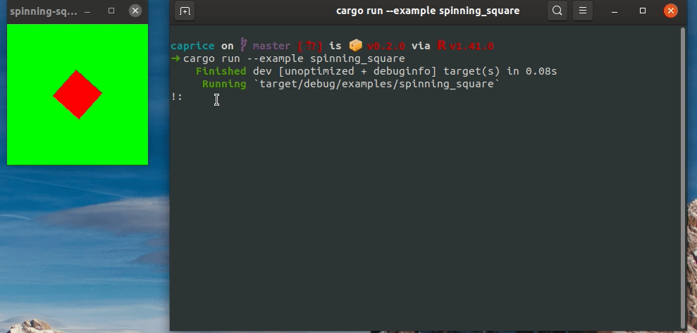

*caprice* is a work in progress REPL for Rust projects featuring an easy to use, zsh like autocomplete feature.



*using caprice with the spinning square example from [Piston](https://github.com/PistonDevelopers/Piston-Tutorials/tree/master/getting-started)*

#### Usage

* typing */list* will print all available tokens in the caprice console in alphabetical order
* pressing tab will cycle between all autocompleted suggestions


*caprice* uses [crossterm](https://github.com/crossterm-rs/crossterm.git) as its terminal emulator.


#### Example:

```rust
use caprice::{Caprice, CapriceCommand};
use std::thread;
use std::time::Duration;
fn main() {
    let mut caprice = Caprice::new()
        .set_prompt("!:") // set the prompt
        .disable_ctrl_c() // pressing control + c won't close the caprice console
        .set_keywords(&[  // set some tokens
            "some_token".to_owned(),
            "some_other_token".to_owned(),
            "exit".to_owned(), // an exit keyword
        ])
        .init(); // initialises the caprice terminal
    // caprice.run() will run the caprice in a separate thread.
    // you can use the returned tx and rx channels for receiving and sending messages
    // to caprice instance
    let (tx, rx, caprice_handle) = caprice.run().unwrap();
    // our main application runs here
    // for this example we will simply print back
    // the tokens send by caprice
    loop {
        // if we received a token from caprice
        if let Ok(token) = rx.try_recv() {
            match token.as_str() {
                // leave if the user types exit
                "exit" => {
                    tx.send(CapriceCommand::Println("bye".to_owned())).unwrap();
                    tx.send(CapriceCommand::Exit).unwrap();
                    caprice_handle.join().expect("couldn't join thread").expect("Caprice run has encountered an error");
                    break; // at this point caprice has already exited, let the main process do as well
                },
                // else send back the token to be printed
                _ => {
                    let print_token = format!("Got {} from Caprice", token);
                    tx.send(CapriceCommand::Println(print_token)).unwrap();
                }
            }
        }
        // let the thread sleep for some time
        thread::sleep(Duration::from_millis(10));
    }
}

```


#### Releases

Release info and changelogs can be found [here](https://github.com/3kyro/caprice/releases)

